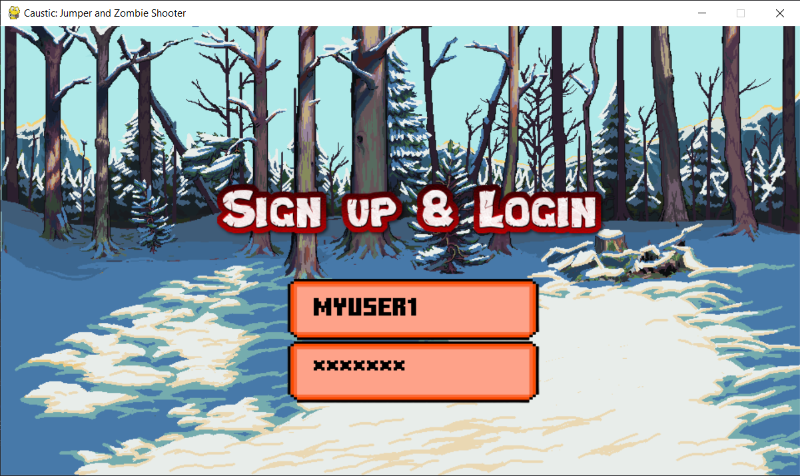
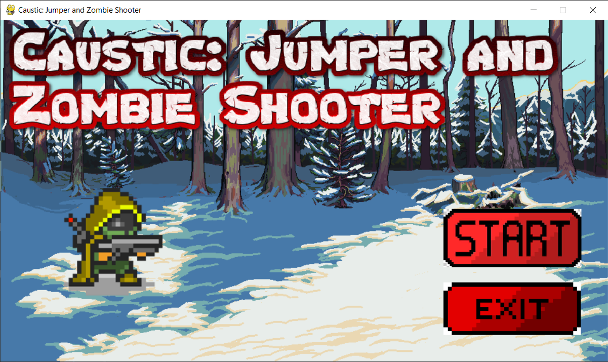
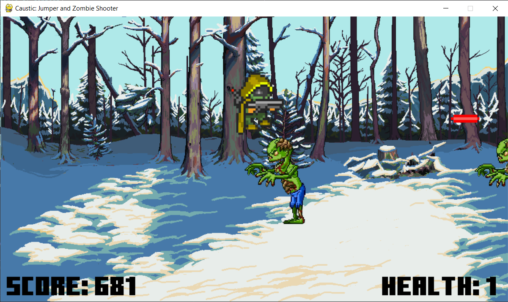
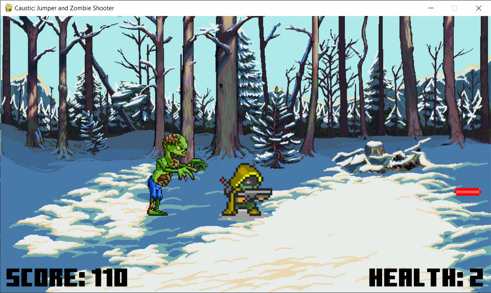
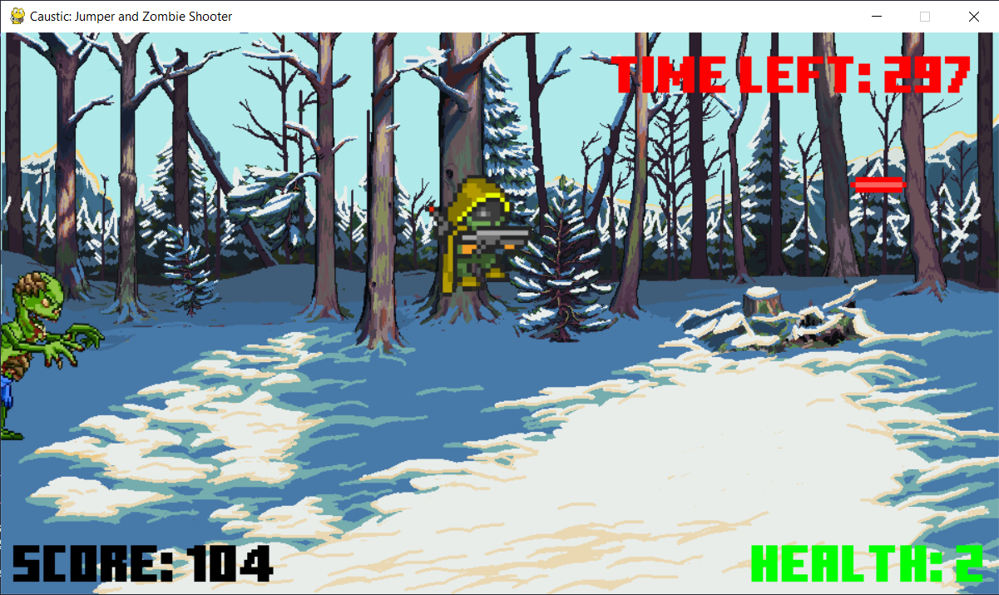
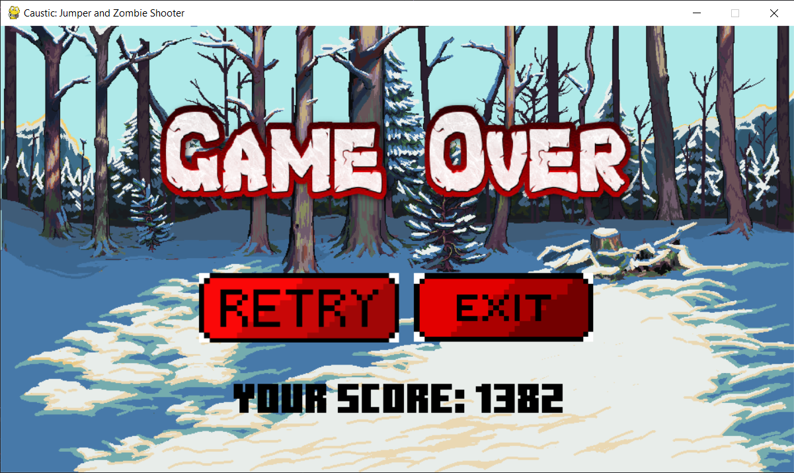
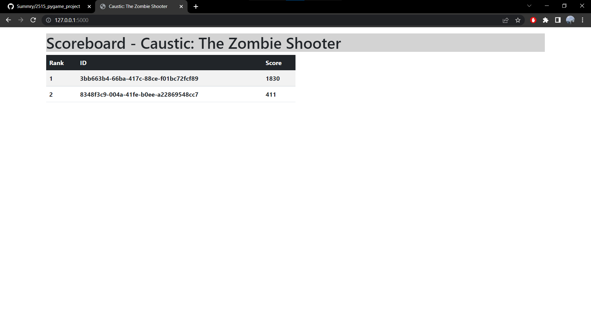
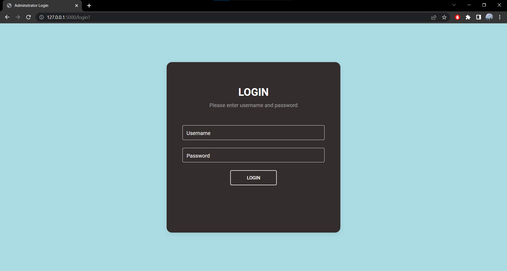
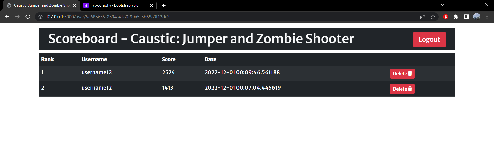

# <ins>**Caustic: Jumper and Zombie Shooter**</ins>

A fun and simple project using Pygame and Flask.

In this game, you will shoot as many zombies as you can, and you will jump as many times as you can. Don't die. No further description.


---

# <ins>**Table of Content**</ins>
- [**Caustic: Jumper and Zombie Shooter**](#caustic-jumper-and-zombie-shooter)
- [**Members**](#members)
- [**Table of Content**](#table-of-content)
- [**Installation**](#installation)
- [**How to Play**](#how-to-play)
  - [**Start the game**](#start-the-game)
  - [**Exit the game**](#exit-the-game)
  - [**Movement**](#movement)
  - [**Shoot Bullet**](#shoot-bullet)
- [**Game Screenshots**](#game-screenshots)
  - [**Sign in Screen**](#sign-in-screen)
  - [**Welcome Screen**](#welcome-screen)
  - [**Game Screen**](#game-screen)
  - [**End Screen**](#end-screen)
  - [**View the Scoreboard**](#view-the-scoreboard)
- [**Go to top**](#go-to-top)

---

# <ins>**Installation**</ins>

Clone the repo: `git clone https://github.com/Summry/Zombie-Shooter.git`

Create a virtual environment.
```
python3 -m venv venv
```

Activate the virtual environment.
```
Windows: ./venv/Scripts/activate
Linux: source ./venv/bin/activate
```

Install the dependencies:

```
pip install -r requirements.txt
```

---

# <ins>**How to Play**</ins>

1. Run the flask app.

```
python app.py
```

2. Run the game.

```
python game.py
```

3. Enter a username and press `ENTER`

4. Enter a password and press `ENTER`

> **Objective:** gain points by jumping or shooting zombies. Be careful though, you only have 3 lives. Constantly jumping may cause you to lose space. Each bullet reloads after a certain amount of time. So, shoot wisely.

---

## <ins>**Start the game**</ins>

- Click the Start button (Welcome Screen)

---

## <ins>**Exit the game**</ins>

- Click the Exit button (Welcome Screen)
- Press `ESC` Key
- Click the `X` on the window display

---

## <ins>**Movement**</ins>

- Jump: `Space` Key
- Move Right: `D` Key
- Move Left: `A` Key

---

## <ins>**Shoot Bullet**</ins>

- Shoot Bullet: `L` Key

---

# <ins>**Game Screenshots**</ins>

## <ins>**Sign in Screen**</ins>



## <ins>**Welcome Screen**</ins>



---

## <ins>**Game Screen**</ins>

- Screenshot 1



- Screenshot 2



- Screeshot 3



---

## <ins>**End Screen**</ins>



---

## <ins>**View the Scoreboard**</ins>

- Homepage



- Login to be able to delete your scores



- Once logged in, you can delete your scores



---

# [<ins>**Go to top**</ins>](#caustic-jumper-and-zombie-shooter)