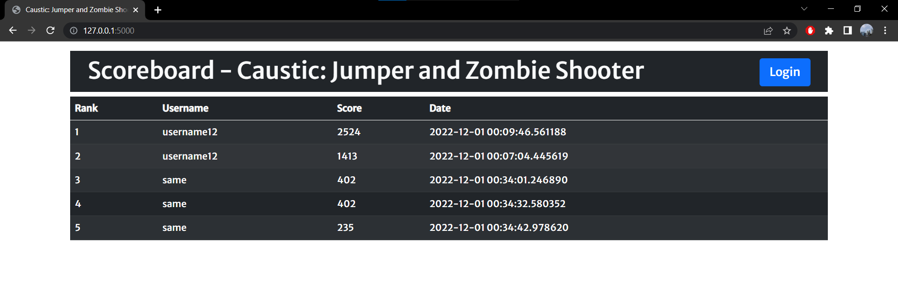

# <ins>**Caustic: Jumper and Zombie Shooter**</ins>

A pygame project for 2515 class.

In this game, you will shoot as many zombies as you can, and you will jump as many times as you can. Don't die. No further description.

---

# <ins>**Members**</ins>

Nazira Fakhrurradi (A01279940) - Set 2B

---

# <ins>**Table of Content**</ins>
- [**Caustic: Jumper and Zombie Shooter**](#caustic-jumper-and-zombie-shooter)
- [**Members**](#members)
- [**Table of Content**](#table-of-content)
- [**Installation**](#installation)
- [**How to Play**](#how-to-play)
  - [**Start the game**](#start-the-game)
  - [**Exit the game**](#exit-the-game)
  - [**Movement**](#movement)
  - [**Shoot Bullet**](#shoot-bullet)
- [**Game Screenshots**](#game-screenshots)
  - [**Sign in Screen**](#sign-in-screen)
  - [**Welcome Screen**](#welcome-screen)
  - [**Game Screen**](#game-screen)
  - [**End Screen**](#end-screen)
  - [**View the Scoreboard**](#view-the-scoreboard)
- [**Go to top**](#go-to-top)

---

# <ins>**Installation**</ins>

Clone the repo: `git clone https://github.com/Summry/2515_pygame_project.git`

---

# <ins>**How to Play**</ins>

1. Run the flask app.

```
python app.py
```

2. Run the game.

```
python game.py
```

3. Enter a username

Gain points by jumping or shooting zombies.

---

## <ins>**Start the game**</ins>

- Click the Start button (Welcome Screen)

---

## <ins>**Exit the game**</ins>

- Click the Exit button (Welcome Screen)
- Press `ESC` Key
- Click the `X` on the window display

---

## <ins>**Movement**</ins>

- Jump: `Space` Key
- Move Right: `D` Key
- Move Left: `A` Key

---

## <ins>**Shoot Bullet**</ins>

- Shoot Bullet: `L` Key

---

# <ins>**Game Screenshots**</ins>

## <ins>**Sign in Screen**</ins>


## <ins>**Welcome Screen**</ins>


---

## <ins>**Game Screen**</ins>

- Screenshot 1


- Screenshot 2


- Screeshot 3


---

## <ins>**End Screen**</ins>


---

## <ins>**View the Scoreboard**</ins>



---

# [<ins>**Go to top**</ins>](#caustic-jumper-and-zombie-shooter)